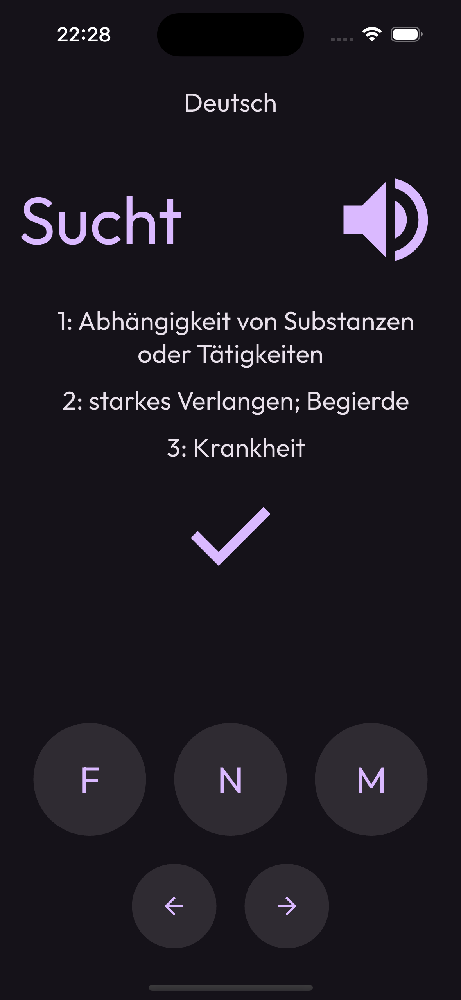

# Gendered

Gendered is a very simple app intended to help with the learning of the gender of nouns in languages such as German, Spanish or French.

As per [Wikipedia](https://en.wikipedia.org/wiki/Grammatical_gender):

> a grammatical gender system is a specific form of a noun class system, where nouns are assigned to gender categories that are often not related to the real-world qualities of the entities denoted by those nouns

Currently only German is supported.

## How it works

The mechanics are as simple as possible. A noun is presented and the user has to choose the right gender for it:

	
	

## How to get it

Gendered is not available in the official app stores yet, and it might never get there because they require a fair amount of paperwork.

Alternative app stores such [F-Droid](https://f-droid.org/) and [AltStore](https://altstore.io/) are being considered.

In the meantime, if you are in desperate need of a build you can try the [development documentation](./docs/development.md).

## Why Gendered

The gender of nouns is crucial in certain languages in order to speak them correctly, so having a dedicated app to practice is very helpful.

### It could have been a website

Correct. But this author happens to enjoy Flutter as a development framework.
